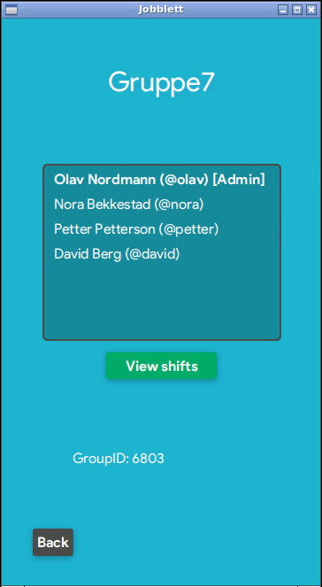
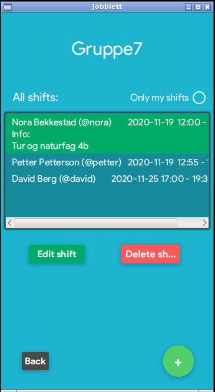
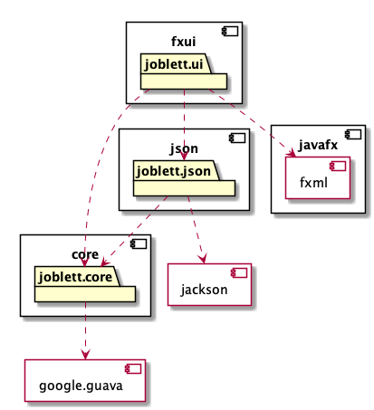

# JobbLett
En app som skal gjøre det enklere å holde oversikt over jobbskift. Arbeidsgiveren oppretter en gruppe der arbeidstakerne blir lagt til. 
Deretter tildeler arbeidsgiveren skift til arbeidstakerne og hele gruppen får en oversikt over hvem som jobber når. 

## Planlagte tilleggsfunksjoner

- Mulighet for å bytte skift mellom arbeidstakerne
- Mulighet for å legge til tilleggsinformasjon knyttet til et skift

[Trykk her for å lese brukerhistorie](Brukerhistorie.md)

Under vises et bilde av appens hovedside. Her ser man navnet på teamet og en oversikt over alle medlemmene i teamet. Gruppe ID-en vises nederst på denne siden og 
andre brukere kan bruke denne ID-en for å bli med i gruppen. Videre kan man trykke seg inn til alle shiftene for teamet. Der kan man få mer info om shiftet ved å trykke på en shift.

## Instruksjoner for gruppeøving
### Gruppeøving 1

Det er ikke mulig å opprette en gruppe selv ennå. Vi har lagt inn testdata slik at noen brukere og en gruppe allerede er opprettet.
Testdataen finner man i [defaultMain.json](src/main/resources/jobblett/json/defaultMain.json) sin main metode. For å logge inn kan du bruke en av disse brukerne sitt brukernavn og passord.
Det er mulig å opprette en bruker også. Brukernavn og passord krav finner man i koden til User klassen. Etter å ha opprettet en bruker vil du måtte skrive inn
en gruppe-ID for å bli med i en gruppe. Denne gruppe ID-en er tilfeldig generert slik at du må logge inn med en av de allerede eksisterende brukerne som allerede
er medlem i testgruppen for å se Gruppe ID-en. Hvis du skriver inn gruppe ID-en skal din bruker også bli medlem av gruppen.

###  Gruppeøving 2
Implementasjon av oppretting av gruppe, legge til jobbshift er nå implementert. Det er i tillegg lagt inn funksjonalitet for at det kun  er administratoren av gruppen
som kan legge til jobbshift.

### Gruppeøving 3
Implementasjon av restAPI, restserver og integrationtests er nå lagt til. I tillegg har dey blitt lagt til endringer i CSS for design av appen, samt større
testdekning. 

## Tilleggsinformasjon

**Du kan lese mer om modulene her:**
* [core](core/)
* [fxui](fxui/)
* [json](json/)
* [restapi](/restapi)
* [restserver](/restserver)
* [integrationtests](/integrationtests)

### Arkitekturdiagram:

