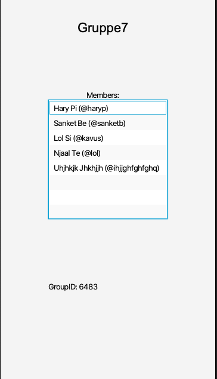

# JobbLett
En app som skal gjøre det enklere å holde oversikt over jobbskift. Arbeidsgiveren oppretter en gruppe der arbeidstakerne blir lagt til. 
Deretter tildeler arbeidsgiveren skift til arbeidstakerne og hele gruppen får en oversikt over hvem som jobber når. 

<h3>Planlagte tilleggsfunksjoner</h3>

- Mulighet for å bytte skift mellom arbeidstakerne
- Mulighet for å legge til tilleggsinformasjon knyttet til et skift

[Trykk her for å lese brukerhistorie](Brukerhistorie.md)

Under vises et bilde av appens hovedside. Her ser man navnet på teamet og en oversikt over alle medlemmene i teamet. 
Her er det planlagt at man vil få en oversikt over teamets jobbskift når appen er ferdig utviklet. Gruppe ID-en vises nederst på denne siden og 
andre brukere kan bruke denne ID-en for å bli med i gruppen.

